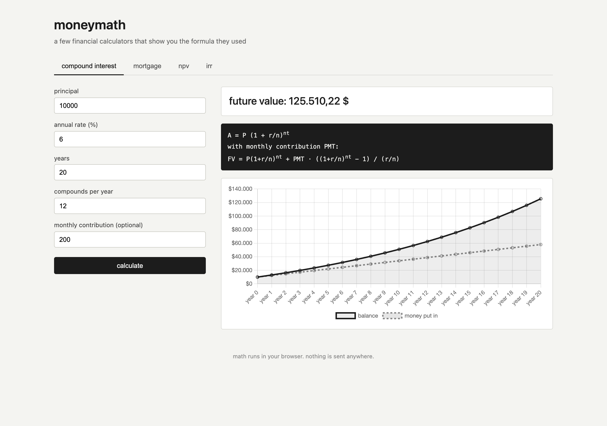

# moneymath



A small toolkit of financial calculators that show their math instead of hiding it. I kept finding myself opening a spreadsheet for the same four things, so I put them in one page.

Four tabs:

1. compound interest, with optional monthly contribution
2. mortgage amortization, full month-by-month table
3. NPV
4. IRR, solved with Newton-Raphson, with the iteration log printed out

The IRR one was the fun part. The rest is closed-form, but IRR has no closed form so it iterates. Each step is logged so you can watch the guess converge.

## Run it

No build step. Open the html file.

```
git clone https://github.com/secanakbulut/moneymath.git
cd moneymath
open index.html
```

Charts use Chart.js loaded from a CDN, so you do need internet for the graphs to render. The math itself works offline.

## The formulas

Each tab prints its formula in the dark box, but here they are for reference.

Compound interest:

```
A = P (1 + r/n)^(nt)
FV with monthly PMT = P(1+r/n)^(nt) + PMT * ((1+r/n)^(nt) - 1) / (r/n)
```

Mortgage payment:

```
M = P * (r(1+r)^n) / ((1+r)^n - 1)
```

where r is the monthly rate and n is the number of months.

NPV:

```
NPV = sum over t of CF_t / (1+r)^t
```

IRR is the rate that makes NPV zero. There is no closed form. I solve it with Newton-Raphson, taking the derivative numerically:

```
x_{k+1} = x_k - f(x_k) / f'(x_k)
f'(x) ~= (NPV(x+h) - NPV(x-h)) / (2h)
```

Starts at 0.1, stops when |NPV| is below 1e-7, gives up after 100 iterations.

## Files

- `index.html` layout and tabs
- `style.css` styling
- `app.js` all four calculators, plus the Newton-Raphson loop
- Chart.js comes in via CDN

## Notes

The amortization table can have a few hundred rows for a 30-year mortgage. The last row gets a tiny rounding adjustment so the balance ends exactly at zero.

The IRR calculator can fail to converge if you hand it a weird cash flow series with multiple sign changes (multiple roots, classic problem). It will say so in the result.

## License

PolyForm Noncommercial 1.0.0. Personal use is fine, commercial use needs a separate agreement.
